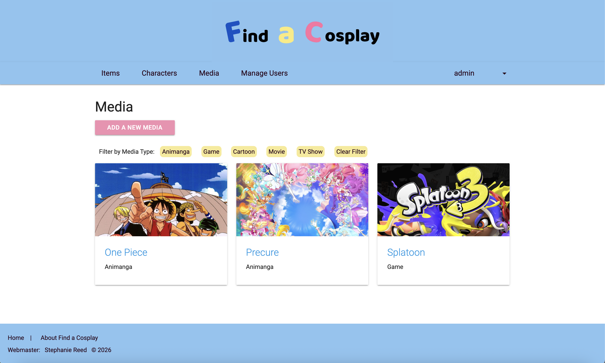
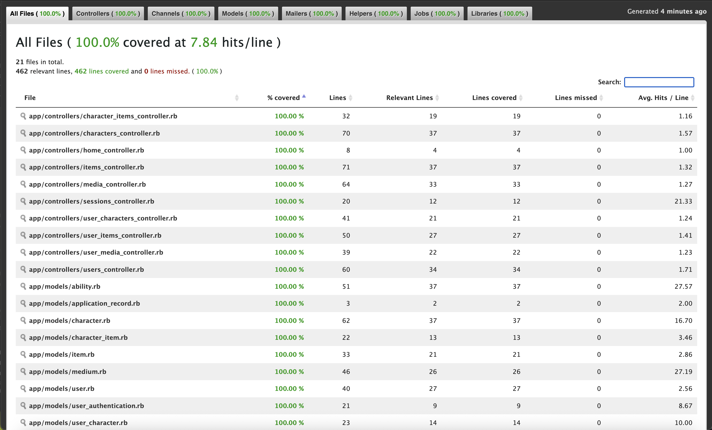
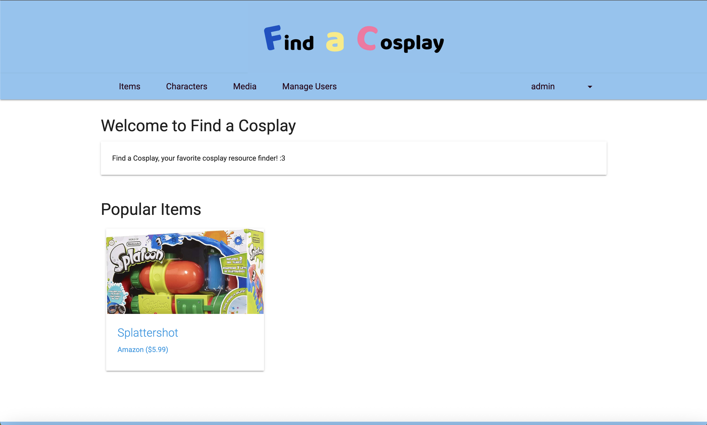
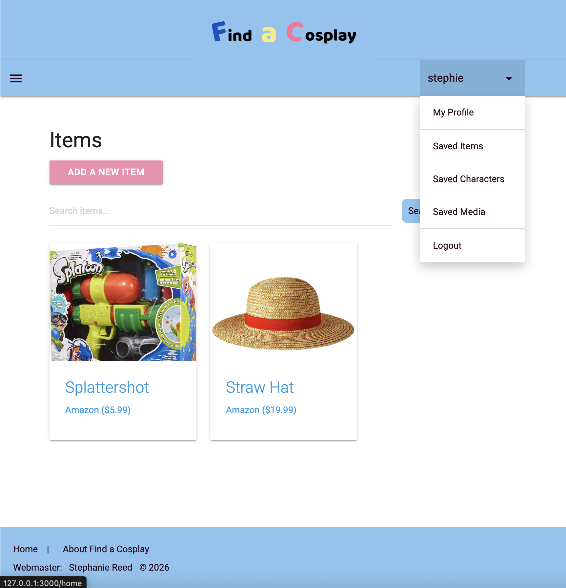
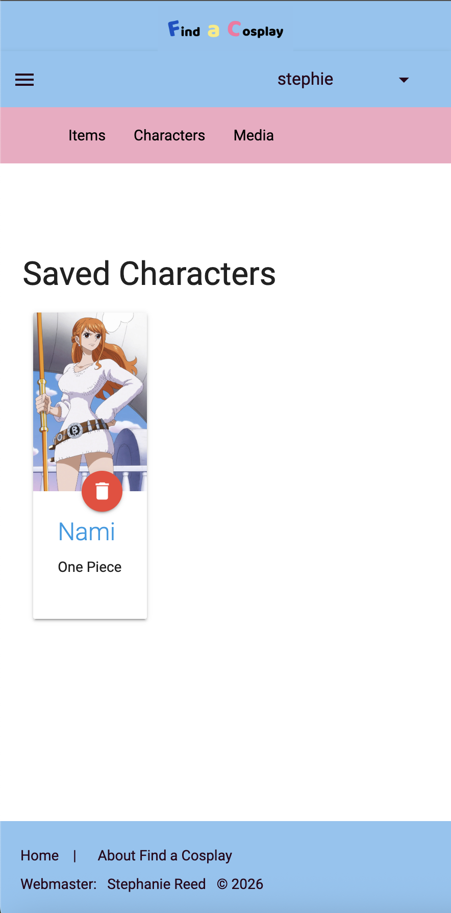

# Find a Cosplay
This site was created as a way to easily keep track of cosplay resources, especially for those that are new to cosplay!  
 
Search for different cosplay items through different characters and media. Save items, characters, or media and leave reviews for items with an account!
 
 

> Note: Find a Cosplay is mainly intended for desktop but is also [compatible with phones and tablets](#phone-and-tablet-compatibility).

## Tech Stack 🛠️
- Ruby 3.1.4
- Rails 7.2
- PostgreSQL
- AWS S3
- JavaScript
- Materialize SCSS

Find a Cosplay is a Ruby on Rails app supported with a PostgreSQL database and AWS S3 buckets for image storage and processing. AWS is essential for uploading and retrieving image attachments for items, characters, and media stored in the database.

## How to Install and Run ▶️
- Download all necessary gems and libraries with `bundle install`
- Create postgres database with `rails db:create` and then `rails db:migrate`
- Start the app by running `rails server` and stop the app with `Ctrl+C`

## Running Tests 📝
Run all unit tests with `rails test` or for more targeted testing: 
- Models: `rails test test/models`
- Controllers: `rails test test/controllers`
- Helpers : `rails test test/helpers`
 
 
> Note: Simple Cov will report the test coverage in the command line and generate a file with a breakdown of the coverage for the most recent tests ran, viewable at `coverage/index.html`. The results should look like the following: 

## Phone and Tablet Compatibility 📱
Find a Cosplay is intended for web use on desktop. However, compatibility with smaller screen sizes was still considered in the development process resulting in the following views on smaller screens:
### Desktop

 
 

### Tablets

 
 

### Phone

